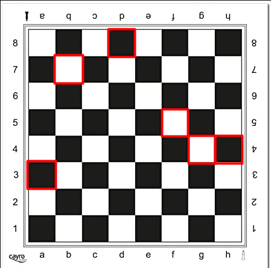

No se utilizará input(), ya que este documento no será interactivo, como producto.

```{r eval=FALSE, echo=FALSE, message=FALSE, warning=FALSE}
# rstudioapi::restartSession()
Sys.setenv(RETICULATE_PYTHON = "C:/Users/Contreras/miniconda3/python.exe") # antes que todo
library(reticulate)
# py_config()
```
# Escribe una secuencia de instrucciones que permitan leer un número real por pantalla y que muestre si el número es positivo o no.

```{python eval=TRUE, echo=TRUE, comment = ''}

for i in [-1, 1, 3.5, 0]:
  if i > 0:
    print(i, 'Es Positivo')
  elif i < 0:
    print(i, 'Es Negativo')
  else:
    print(i, 'Es Cero')
  
```

```{python}
import pandas as pd
s = pd.Series(['Matemáticas', 'Historia', 'Economía', 'Programación', 'Inglés'], dtype='string')
print(s)
```


# Escribe una secuencia de instrucciones que permitan leer un número real por pantalla y que muestre si el número está en el rango entre -5 y 5

```{python eval=TRUE, echo=TRUE, comment = ''}

for i in [-10, 1, 3.5, 7, 4, 3]:
  if i >=-5 and i <= 5:
    print(i, 'Esta dentro de intervalo cerrado entre -5 y 5')
  else:
    print(i, 'No esta dentro de intervalo cerrado entre -5 y 5')
  
```

# Escribe una secuencia de instrucciones que permitan leer las coordenadas de un punto (x, y) e indique en cuál de los cuatro cuadrantes se encuentra dicho punto.

```{python eval = TRUE, echo = TRUE, comment = ''}
a = [(1,5), (-2,6), (-8, -8), (3, -9)]

for i in range(len(a)):
  if a[i][0] > 0 and a[i][1] > 0:
    print('La coordenada', a[i],'pertenece al I Cuadrante')
  elif a[i][0] < 0 and a[i][1] > 0:
    print('La coordenada', a[i],'pertenece al II Cuadrante')
  elif a[i][0] < 0 and a[i][1] < 0:
    print('La coordenada', a[i],'pertenece al III Cuadrante')
  elif a[i][0] > 0 and a[i][1] < 0:
    print('La coordenada', a[i],'pertenece al IV Cuadrante')
    
```

# Escribe una secuencia de instrucciones que permitan leer dos números enteros y muestre el cociente de la división entera y el resto.

```{python eval = TRUE, echo = TRUE, comment = ''}
import math
a = [(20,6), (56,6), (40, 4), (31002, 1024)]
for i in range(len(a)):
  print('El cociente de '+ str(a[i][0]) + 
        ' y ' + str(a[i][1])+ ' es ' + 
        str(math.remainder(a[i][0],a[i][1])),'y el resto' + 
        ' es ' + str(math.fmod(a[i][0],a[i][1])))
```

# Escribe una secuencia de instrucciones que permitan leer un número entero si es cuadrado perfecto o no (piensa la mejor forma de hacerlo con lo que has aprendido hasta ahora)

```{python eval = TRUE, echo = TRUE, comment = ''}
import numpy as np
import math
a = [81, 123, 1024, 64, 56, 87, 90, 64, 49]
for i in range(len(a)):
  b = math.modf(np.sqrt(a[i]))
  if b[0] == 0.0:
    print('La raiz de ' + str(a[i]) + ' es ' + str(b[1]) + 
    ' y es un cuadrado perfecto, porque su parte decimal es igual a ' + str(b[0]))
  else:
    print('La raiz de ' + str(a[i]) + ' es ' + str(round(b[1] + b[0], 3)) + 
    ', no un cuadrado perfecto, porque su parte decimal no es igual a 0.0')
```

# Escribe una expresión que permita determinar si un número entero positivo puede corresponder a un año bisiesto o no. Se consideran años bisiestos aquellos cuyo número es divisible por cuatro excepto los años que son múltiplos de 100, a no ser que lo sean de 400 (por ejemplo el año 2000 fue bisiesto pero el 2100 no lo será).

```{python eval = TRUE, echo = TRUE, comment = ''}
a = [2000, 2100, 2010, 2008, 2017, 2654, 2456, 2367]

for i in a:
  if i % 4 == 0:
    if i % 100:
      if i % 400:
        print("El año {} es bisiesto".format(i))
      else: 
        print("El año {} no es bisiesto".format(i))
    else: 
        print("El año {} es bisiesto".format(i))
  else: 
    print("El año {} no es bisiesto".format(i))
```

# Busca la imagen de un tablero de ajedrez en Google y fíjate en la nomenclatura de las casillas. Escribe una expresión lea una letra y un número de teclado correspondiente a una casilla de un tablero de ajedrez y nos indique si esta casilla es negra o blanca.

```{python eval = TRUE, echo = TRUE, comment = ''}
lista = ['A3', 'B7', 'D8', 'F5', 'G4', 'H4']
for i in lista:
  dic = {'A':2,'B':1,'C':2,'D':1,'E':2,'F':1,'G':2,'H':1}
  if (int(i[1])) % 2 == 0 and dic[i[0]] % 2 == 0:
      print('La casilla ', i,' es de color blanco')
  elif (int(i[1])) % 2 != 0 and dic[i[0]] % 2 != 0:
      print('La casilla ', i,' es de color blanco')
  else:
      print('La casilla ', i,' es de color negro')
```

```{r, echo=FALSE, out.width='80%', fig.align='center'}

```